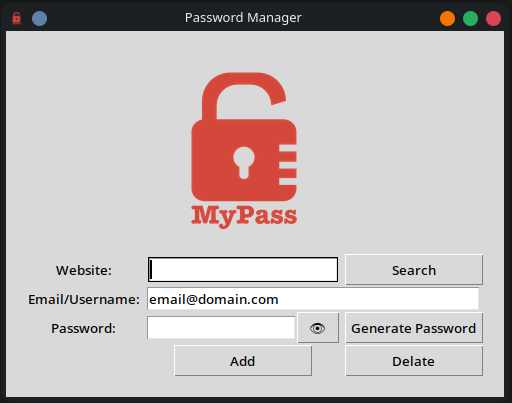

# AppPassword

A simple GUI app to save passwords for emails.



## Features

- **Encryption**: AES-128 with Fernet
- Search, add and delete credentials
- Show/hide password
- Portable executable
- Generate secure passwords

### Technologies

- Python 3
- Tkinter
- Cryptography (Fernet)
- PyInstaller

## Getting Started

1. Clone the repository:

```bash
git clone https://github.com/PaavaliRomero/AppPassword.git
```

2. Navigate to the project directory:

```bash
cd Class_29_GUI_appPass
```

3. Install dependencies:

```bash
pip install -r requirements.txt
```

4. Run the app:

```bash
python src/main.py
```

## Executable

Download the latest release [here](https://github.com/PaavaliRomero/AppPassword/releases).

Or generate your own:

```bash
pip install pyinstaller
pyinstaller --onefile --windowed --name "PasswordManager" --add-data "Image:Image" --icon "Image/logo.png" src/main.py
```

## Folder Structure

**Development** (after running):

```
Class_29_GUI_appPass/
├── .gitignore
├── README.md
├── requirements.txt
├── Image/
│   └── logo.png
├── data/                ← created on first save (gitignored)
│   └── data.json        ← encrypted data
├── key.key              ← encryption key (gitignored)
├── src/
│   ├── main.py          ← entry point
│   ├── gui_interface.py ← GUI
│   └── data_manager.py  ← logic and encryption
└── dist/                ← created by PyInstaller (gitignored)
    └── PasswordManager  ← portable executable
```

**Repository** (on GitHub):

```
Class_29_GUI_appPass/
├── .gitignore
├── README.md
├── requirements.txt
├── Image/
│   └── logo.png
└── src/
    ├── main.py
    ├── gui_interface.py
    └── data_manager.py
```
